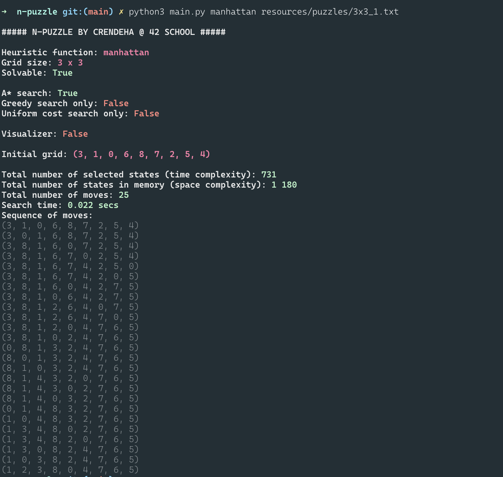

# n-puzzle solver

**N-puzzle solver (School 42 Project)**
<br></br>

## About n-puzzle

**The n-puzzle** is a sliding puzzle having `n * n - 1` square tiles numbered from `1` to ` n * n - 1` in a frame that is `n` tiles high and `n` tiles wide, leaving one unoccupied tile position. Tiles in the same row or column of the open position can be moved by sliding them horizontally or vertically, respectively. The goal of the puzzle is to place the tiles in spiral order. [[Wiki]](https://en.wikipedia.org/wiki/15_puzzle)


### How to use

1. Install required packages:

	```
	pip install --no-cache-dir -r requirements.txt
	```
2. Run n-puzzle solver:

	```
	python3 main.py [-h] [-u | -g | -n] [-v] heuristic_function file

	positional arguments:
	  heuristic_function  specifies heuristic function (not specified if -g or -n flag is enabled)
	  file                file, which contains the initial grid

	optional arguments:
	  -h, --help          show this help message and exit
	  -u                  enable only uniform cost search
	  -g                  enable only greedy search
	  -n                  enable non-admissible heuristics (Nilsson sequence score)
	  -v                  use visualizer
	```

3. Try again :) <br></br>

## Heuristics

- **Admissible** - guarantees optimal solution [[Wiki]](https://en.wikipedia.org/wiki/Admissible_heuristic)
	- Manhattan distance
	- Euclidean distance
	- Out of place tiles
	- Number of tiles out of row + Number of tiles out of column 
<br></br>
- **Non-admissible** - A non-admissible heuristic may overestimate the cost of reaching the goal. It may or may not result in an optimal solution. However, the advantage is that sometimes, a non-admissible heuristic expands much fewer nodes. Thus, the total cost (= search cost + path cost) may actually be lower than an optimal solution using an admissible heuristic. [[Source]](https://cse.iitk.ac.in/users/cs365/2009/ppt/13jan_Aman.pdf)
	- Nilsson's sequence score <br></br>

## Output

 <br></br>

## Visualizer

 <br></br>

Try `python3 main.py -u -v nilsson resources/puzzles7x7.txt` for really fun visualizer! :)
<br></br>

## Additional tools

- **Puzzles generator**. Usage:

	1. Switch to `src` directory:

		```
		cd src
		```
	2. Run generator:

		```
		python3 generator.py [-h] [-s] [-u] [-i ITERATIONS] size

		positional arguments:
		  size                  Size of the puzzle's side. Must be >3.

		optional arguments:
		  -h, --help            show this help message and exit
		  -s, --solvable        Forces generation of a solvable puzzle. Overrides -u.
		  -u, --unsolvable      Forces generation of an unsolvable puzzle
		  -i ITERATIONS, --iterations ITERATIONS
		                        Number of passes
		```

- **Tester**. Usage:

	1. Switch to `tests` directory:

		```
		cd tests
		```
	2. Run tests (you can customize them in `tester.py`):

		```
		pytest -rA tester.py
		```